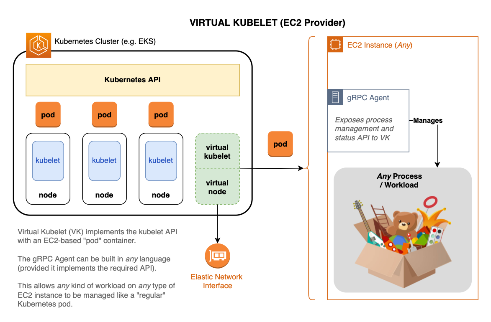

[](https://github.com/awslabs/aws-virtual-kubelet/actions/workflows/validation.yaml)  

# AWS Virtual Kubelet
AWS Virtual Kubelet aims to provide an extension to your [Kubernetes](https://kubernetes.io/) cluster that can provision and maintain [EC2](https://aws.amazon.com/ec2/) instances through regular Kubernetes operations. This enables usage of non-standard operating systems for container ecosystems, such as MacOS.

This expands the management capabilities of Kubernetes, enabling use-cases such as macOS native application lifecycle control via standard Kubernetes tooling.

## Architecture



See [Software Architecture](docs/SoftwareArchitecture.md) for an overview of the code organization and general behavior.  For detailed coverage of specific aspects of system/code behavior, see [implemented RFCs](docs/rfcs/implemented).

### Components

<dl>
  <dt>Virtual Kubelet (VK)</dt>
  <dd>Upstream library / framework for implementing custom Kubernetes providers</dd>
  <dt>Virtual Kubelet Provider (VKP)</dt>
  <dd>This EC2-based provider implementation (sometimes referred to as <i>virtual-kubelet</i> or <b>VK</b> also)</dd>
  <dt>Virtual Kubelet Virtual Machine (VKVM)</dt>
  <dd>The Virtual Machine providing compute for this provider implementation (i.e. an Amazon EC2 Instance)</dd>
  <dt>Virtual Kubelet Virtual Machine Agent (VKVMA)</dt>
  <dd>The gRPC agent that exposes an API to manage workloads on EC2 instances (also VKVMAgent, or just Agent)</dd>
</dl>

### Mapping to Kubernetes components

**kubelet** → Virtual Kubelet library + this custom EC2 provider
**node** → Elastic Network Interface (managed by VKP)  
**pod** → EC2 Instance + VKVMAgent + Custom Workload  

## Prerequisites
The following are required to build and deploy this project.  Additional tools may be needed to utilize examples or set up a development environment.

### Go (lang)

Tested with [Go](https://golang.org) v1.12, 1.16, and 1.17.  See the [Go documentation](https://golang.org/doc/install) for installation steps.

### Docker

[Docker](https://www.docker.com/) is a container virtualization runtime.

See [Get Started](https://www.docker.com/get-started) in the docker documentation for setup steps.

## Structure

This project uses this [Go Project Layout](https://github.com/golang-standards/project-layout) pattern.  A top-level `Makefile` provides necessary build and utility functions.  Run `make` by itself (or `make help`) to see a list of common targets.

## External Libraries Used

- [virtual-kubelet](https://github.com/virtual-kubelet/virtual-kubelet)
  - provides the Virtual Kubelet (VK) interface between this custom provider and [Kubernetes](https://kubernetes.io/)
- [node-cli](https://github.com/virtual-kubelet/node-cli)
  - abstracts the VK provider command interface into a separate, reusable project[^1]

Example files that require updating placeholders with actual (environment-specific) data are copied to `./local` before modification.  The `local` directory's contents are ignored, which prevents accidental commits and _leaking_ account numbers, etc. into the GitHub repo.

## Setup

For local development and testing setup see [DevSetup.md](docs/DevSetup.md)

1. Run `kubectl apply -f deploy/vk-clusterrole_binding.yaml` to deploy the cluster role and binding.

### ConfigMap
The [ConfigMap](https://kubernetes.io/docs/concepts/configuration/configmap/) provides global and default VK/VKP configuration elements.  Some of these settings may be overridden on a per-pod basis.

1. Copy the provided [examples/config-map.yaml](examples/config-map.yaml) to the `./local` dir and modify as-needed.  See [Config](docs/Config.md) for a detailed explanation of the various configuration options.

2. Next, run `kubectl apply -f local/config-map.yaml` to deploy the config map.

### StatefulSet
This configuration will deploy a set of VK providers using the docker image built and pushed earlier.

1. Copy the provided [examples/vk-statefulset.yaml](examples/vk-statefulset.yaml) file to `./local`.
2. Replace these placeholders in the `image:` reference with the values from your account/environment
   1. `AWS_ACCOUNT_ID`
   2. `AWS_REGION`
   3. `DOCKER_TAG`
3. Run `kubectl apply -f local/vk-statefulset.yaml` to deploy the VK provider pods.

## Usage

1. Create an ECR repository in your AWS account.

```bash
aws ecr create-repository --repository-name aws-virtual-kubelet
```

2. in the [Makefile](Makefile), change the `REGISTRY_ID` to your AWS Account ID, the `REGION` to your desired AWS Region, and the `IMAGE_NAME` to the name of the created ECR repository.

3. Build the virtual kubelet docker image, and push it to ECR.

```bash
make push
```

4. Create an S3 Bucket

```bash
aws s3 mb s3://vk-bootstrap-agent
```

5. Build the Bootstrap Agent and upload to s3

```bash
cd examples/bootstrap_agent
go build *.go
aws s3 cp bootstrap_agent s3://vk-bootstrap-agent/bootstrap_agent
```

6. Create the virtual-kubelet namespace
This will hold all relevant K8S resources related to the virtual kubelet.

```bash
kubect create namespace virtual-kubelet
```

7. Deploy a ConfigMap with required Virtual Kubelet configurations
Fill in the values based on the Configuration section below.
For a full example, see [examples/config-map.yaml](examples/config-map.yaml)

```bash
kubectl apply -f examples/config-map.yaml
```

8. Deploy the cluster role binding
First, update [deploy/vk-clusterrole_binding.yaml](deploy/vk-clusterrole_binding.yaml) by replacing `YOUR-IAM-ROLE-NAME-HERE` with the IAM role you will use to manage resources in the `virtual-kubelet` namespace. Then, deploy the cluster role binding:

```bash
kubectl apply -f deploy/vk-clusterrole_binding.yaml
```

9. Deploy the virtual kubelet stateful set
First, update [deploy/vk-statefulset.yaml](deploy/vk-statefulset.yaml) with an updated `image:` value based on image registry location. This would have been presented in the docker push logs. Example: `<ACCOUNT_ID>.dkr.ecr.<REGION>.amazonaws.com/aws-virtual-kubelet:v0.5.3-2-g46b7568-dev-amd64`

```bash
kubectl apply -f deploy/vk-statefulset.yaml
```

10. Check the status of the stateful set, to ensure the service is running

```bash
kubectl describe statefulset -n virtual-kubelet
kubectl get pods -n virtual-kubelet
```

You should now be able to run workloads targeting the new EC2-based K8S nodes.

## Configuration

Create a configuration file (JSON) with the following keys and appropriate values. For a full example, see [examples/config.json](examples/config.json)

### General Config

- `ManagementSubnet`: Subnet in which you expect to deploy the Virtual Kubelet, which generates an AWS ENI for the purposes of creating a unique location for the Kubenernetes IP address.
- `ClusterName`: Included for tagging purposes to manage AWS ENIs associated with Virtual Kubelet.
- `Region`: Code for AWS Region the Virtual Kubelet will be deployed to. e.g. `us-west-2` or `us-east-1`.

### VMConfig Section

- `InitialSecurityGroups`: AWS SecurityGroups assigned to an EC2 instance at launch time, which can be updated later.
- `DefaultAMI`: AMI used when there is no other AMI specified in Podspec of a Kubernetes Pod.
- `InitData`: Base64 encoded JSON to be processed by the Bootstrap Agent. TODO need to know how this is used, and an example content.

### BootstrapAgent Section

- `S3Bucket`: Bucket location in S3 where bootstrap agent is located.
- `S3Key`: Key location in S3 where bootstrap agent is located.
- `GRPCPort`: Port number for GRPC communication between Virtual Kubelet and the EC2 instances it creates.
- `InitData`: Base64 encoded JSON to be processed by the Bootstrap Agent. TODO need to know how this is used, and an example content.

### WarmPoolConfig Section

- `DesiredCount`: Amount of EC2 to be maintained in the WarmPool, above and beyond what is required to run Kubernetes Pods.
- `IamInstanceProfile`: The IAM instance profile assigned to the EC2 at launch time, which can be changed at Pod assignment time. This needs to at minimum have read access to the bootstrap agent in S3, `ec2:RunInstances`,`ec2:DescribeNetworkInterfaces`,`ec2:CreateNetworkInterface`,`iam:PassRole` on itself, and also any application-specific AWS access for workloads running on the virtual node(s).
- `SecurityGroups`: The AWS Security Groups assigned to the EC2 at launch time, which can be changed at Pod assignment time.
- `KeyPair`: The EC2 credentials assigned to allow for SSH/RDP access to the instance. Unchangeable at Pod assignment time.
- `ImageID`: The AWS AMI to launch the EC2 instances with, Unchangeable at Pod assignment time.
- `InstanceType`: The AWS EC2 InstanceType, e.g. `mac1.metal`. Unchangeable at Pod assignment time.
- `Subnets`: The AWS VPC Subnet(s) to deploy the WarmPool EC2 instances into. Unchangeable at Pod assignment time.

## Frequently Asked Questions

**`TODO`** add more FAQ items here as-needed

### Why does this project exist?

This project serves as a translation and mediation layer between Kubernetes and EC2-based pods.  It was created in order to run custom workloads directly on any EC2 instance type/size available via AWS (e.g. [Mac Instances](https://aws.amazon.com/ec2/instance-types/mac/)).

### How can I use it?

See **`TODO`** <insert link to doc here> for steps to customize this project for your particular needs.

## Security

See [CONTRIBUTING](docs/Contributing.md#security-issue-notifications) for more information.

## License

This project is licensed under the [Apache-2.0 License](https://www.apache.org/licenses/LICENSE-2.0).

## Style Guide

### Go

**`TODO`**

## Reference

**`TODO`** Add "article" and external reference links here

- [Some useful article](https://example.com)
